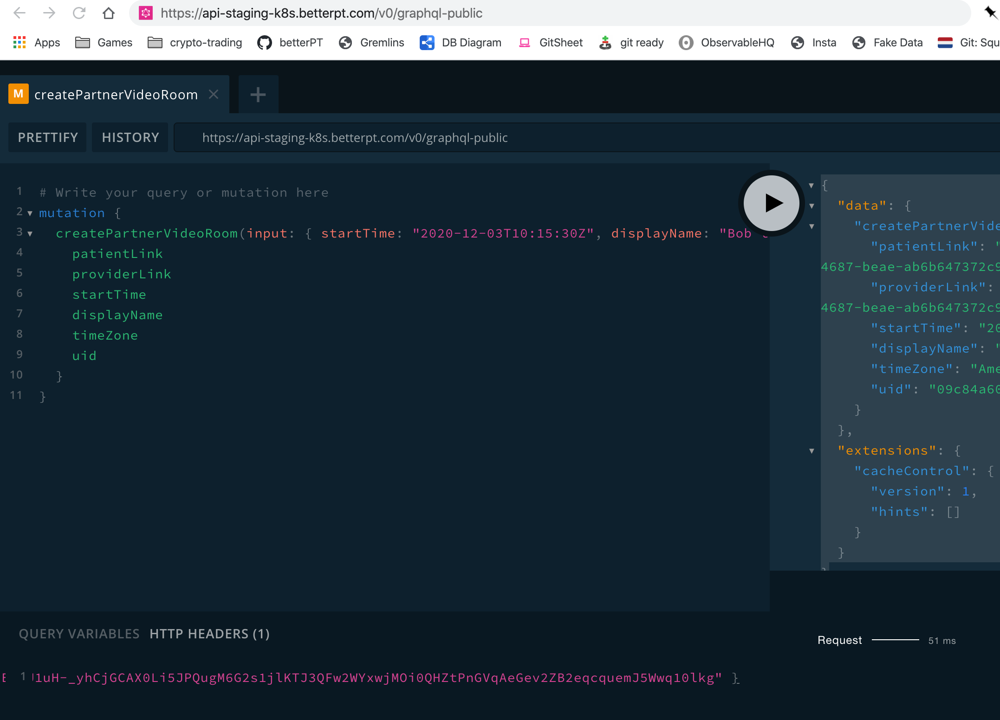

# GraphQL API

## Overview

BetterPT's next-generation API is built on top of [GraphQL](https://graphql.org/). It is fast, type-safe, self-documenting, and flexible. Plus, all of the cool kids and hipsters are using it. We really dig it.

However, we also realize that not everyone has used GraphQL before. The learning curve on the client-side is quite gentle. Here are a few resources to get started:

* [GraphQL Home](https://graphql.org)
* [GraphQL Clients](https://graphql.org/code/#graphql-clients)

Recommended Clients

* [C\#/.NET](https://chillicream.com/blog/2019/11/25/strawberry-shake_2)
* [Java/Scala](https://github.com/americanexpress/nodes)
* [node.js](https://github.com/prisma-labs/graphql-request)
* [React.js, Angular, Vue](https://www.apollographql.com/docs/react/)

## The Schema

You can access the schema via the "Public" Playground after you have logged into your account.There you can see the schema with relevant information, you can test queries and mutations, etc.

## The Playground


**The best place to get started with BetterPT's API is to make some test queries and mutations in the GraphQL Playground.** **This also acts as the most up-to-date documentation. Operations are clearly labeled and all types are visible.**


Visit [https://api-staging-k8s.betterpt.com/v0/graphql-public](https://api-staging-k8s.betterpt.com/v0/graphql-public) and you will see the following:




**Please make sure that the URL is the same in BOTH the top browser URL bar and the bottom playground URL bar or the playground will not load correctly.**


## Queries and Mutations

Because we are only interested in video rooms, the operations that matter to us are:

1. `createPartnerVideoRoom(...): PartnerVideoRoom`

Here is an example mutation:

```graphql
mutation createPartnerVideoRoom($input: CreatePartnerVideoRoomInput){
    createPartnerVideoRoom(input: $input){
        uid
        startTime
        timeZone
        displayName
        patientLink
        providerLink
        patientDuration
        providerDuration
        didPatientAttend
        didProviderAttend
        status
    }

```

2. `partnerVideoRoom(uid: String!): PartnerVideoRoom`

Here is an example query:

```graphql
query partnerVideoRoom($uid: ID!){
    partnerVideoRoom(uid: $uid){
        uid
        startTime
        timeZone
        displayName
        partnerCustomerId
        partnerProviderEmail
        partnerPatientEmail
        patientLink
        providerLink
        patientDuration
        providerDuration
        didPatientAttend
        didProviderAttend
        status
    }
}
```

3. `cancelPartnerVideoRoom(uid: ID!): PartnerVideoRoom`

Here is an example mutation:

```graphql
mutation cancelPartnerVideoRoom($uid: ID!) {
    cancelPartnerVideoRoom(uid: $uid) {
        uid
        ...
    }
}
```

4. `reschedulePartnerVideoRoom(input: ReschedulePartnerVideoRoomInput!): PartnerVideoRoom`

Here is an example mutation:

```graphql
mutation reschedulePartnerVideoRoom($input: ReschedulePartnerVideoRoomInput!) {
    reschedulePartnerVideoRoom(input: $input) {
        uid
        startTime
        ...
    }
}
```

## Using the data in real life

All of this GraphQL stuff has been super-fun and I would love to write more about it \(I really would, I'm a bit obsessed with GraphQL\) but how do we use this data in the real world? The response provides the following:

1. Two links that are clearly marked as for the provider or for the patient.
2. The time zone.
3. The "display name" of the PT - this is displayed in the video interface.
4. The `uid`.

In order to start a session:

1. The patient opens the patient link, the provider opens the provider link.
2. The provider must start the session.

**The session is open for 60 minutes and users can enter five minutes before the start time. Once a session has started, it cannot be updated.**

## Patient and Provider Outreach


This is not part of the standard API offering - if you are interested please contact sales@betterpt.com


### Outreach Summary \(in active development\)

If BetterPT is provided with `partnerClinicName`and `partnerPatientEmail`and/or `partnerPatientPhoneNumber`, we can handle communication of status changes and reminders for our hosted Video Rooms.

### Specific Outreach Events & Reminder Schedule

**Communication Schedule & Methods - Patient Email Provided**

* **Initial Confirmation** - Email sent with iCal attachment
* **Reschedule** -  Email sent with iCal attachment
* **Cancellation** - Email 
* **One hour reminder** - Email
* **Fifteen-minute reminder** - Email

**Communication Schedule & Methods - Phone Number Provided**

* **Initial Confirmation** - SMS
* **Reschedule** - SMS
* **Cancellation** - SMS 
* **One hour reminder** - SMS
* **Fifteen-minute reminder** - SMS

**Communication Schedule & Methods - Patient Email & Phone Provided**

* **Initial Confirmation** - Email sent with iCal attachment 
* **Reschedule** - Email sent with iCal attachment / SMS sent
* **Cancellation** - Email 
* **One hour reminder** - Email / SMS Sent
* **Fifteen-minute reminder** - Email / SMS sent

## Data and Analytics

By performing the `partnerVideoRoom` query, you can retrieve a `PartnerVideoRoom.`

```graphql
type PartnerVideoRoom {
    uid: ID!
    startTime: DateTime!
    timeZone: String!
    patientLink: String!
    providerLink: String!
    displayName: String
    partnerCustomerId: String
    patientDuration: Int
    providerDuration: Int
    didPatientAttend: Boolean
    didProviderAttend: Boolean
    status: PartnerVideoRoomStatusEnum
}
```

With this data, you can produce a simple report on Telehealth call duration, status, etc.

